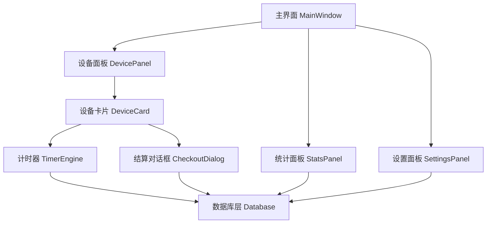

# 电玩店计时管理系统 - 开发文档

## 项目概述

**项目名称：** 电玩店计时管理系统 (VideoGame Timer)  
**开发语言：** Python 3.10+  
**目标平台：** Windows 桌面应用  
**UI 框架：** PyQt6 / Tkinter (推荐 PyQt6，界面更现代)  
**数据库：** SQLite（本地轻量级，无需服务器）  

---

## 功能需求

### 核心功能

| 功能模块 | 描述 |
|---------|------|
| 设备管理 | 添加/编辑/删除游戏主机，设置主机类型和单价 |
| 计时管理 | 开始/暂停/结束计时，实时显示已用时间和费用 |
| 收款结算 | 计算费用、记录收款金额、找零计算 |
| 统计报表 | 每日/每月收入统计、设备使用率 |
| 系统设置 | 价格配置、设备类型管理 |

### 功能详细说明

#### 1. 设备管理
- 支持多种主机类型：PS4、PS5、Xbox、Switch、其他
- 每种类型可设置不同的每小时单价
- 设备状态：空闲、使用中、维护中
- 设备编号/名称自定义（如：1号PS5、2号Switch）

#### 2. 计时管理
- 点击设备卡片开始计时
- 实时显示：已用时间（时:分:秒）、当前累计费用
- 支持暂停计时（如客户临时离开）
- 结束计时时自动计算总费用
- 计费规则：按实际分钟计费（不足1小时按比例计算）

#### 3. 收款结算
- 显示应收金额
- 输入实收金额，自动计算找零
- 支持备注（如：优惠、赠送时间等）
- 结算后记录到数据库

#### 4. 统计报表
- 今日收入总览
- 各设备使用次数和收入
- 历史记录查询（按日期筛选）
- 简单图表展示（可选）

---

## 系统架构



### 模块划分

```
VideoGame/
├── main.py                  # 程序入口
├── requirements.txt         # 依赖库列表
├── config.py                # 全局配置
├── database/
│   ├── __init__.py
│   ├── db_manager.py        # 数据库连接和初始化
│   └── models.py            # 数据模型定义
├── core/
│   ├── __init__.py
│   ├── timer_engine.py      # 计时核心逻辑
│   └── billing.py           # 计费逻辑
├── ui/
│   ├── __init__.py
│   ├── main_window.py       # 主窗口
│   ├── device_panel.py      # 设备管理面板
│   ├── device_card.py       # 单个设备卡片组件
│   ├── checkout_dialog.py   # 结算对话框
│   ├── stats_panel.py       # 统计报表面板
│   └── settings_dialog.py   # 设置对话框
├── assets/
│   └── icons/               # 图标资源
└── data/
    └── videogame.db         # SQLite 数据库文件
```

---

## 数据库设计

### 表结构

#### `device_types` - 设备类型表
| 字段 | 类型 | 说明 |
|------|------|------|
| id | INTEGER PK | 主键 |
| name | TEXT | 类型名称（如 PS5、Switch） |
| hourly_rate | REAL | 每小时单价（元） |
| created_at | DATETIME | 创建时间 |

#### `devices` - 设备表
| 字段 | 类型 | 说明 |
|------|------|------|
| id | INTEGER PK | 主键 |
| name | TEXT | 设备名称（如 1号PS5） |
| device_type_id | INTEGER FK | 关联设备类型 |
| status | TEXT | 状态：idle/active/paused/maintenance |
| created_at | DATETIME | 创建时间 |

#### `sessions` - 使用记录表
| 字段 | 类型 | 说明 |
|------|------|------|
| id | INTEGER PK | 主键 |
| device_id | INTEGER FK | 关联设备 |
| start_time | DATETIME | 开始时间 |
| end_time | DATETIME | 结束时间（NULL表示进行中） |
| pause_duration | INTEGER | 暂停总秒数 |
| total_seconds | INTEGER | 实际计费秒数 |
| hourly_rate | REAL | 计费时的单价（快照） |
| total_amount | REAL | 应收金额 |
| paid_amount | REAL | 实收金额 |
| note | TEXT | 备注 |
| status | TEXT | 状态：active/paused/completed |

#### `pause_records` - 暂停记录表
| 字段 | 类型 | 说明 |
|------|------|------|
| id | INTEGER PK | 主键 |
| session_id | INTEGER FK | 关联使用记录 |
| pause_start | DATETIME | 暂停开始时间 |
| pause_end | DATETIME | 暂停结束时间 |

---

## UI 界面设计

### 主界面布局

```
┌─────────────────────────────────────────────────────┐
│  🎮 电玩店计时管理系统          [统计] [设置]  [最小化][关闭] │
├─────────────────────────────────────────────────────┤
│  今日收入: ¥ 320.00    使用中: 3台    空闲: 5台          │
├─────────────────────────────────────────────────────┤
│                                                     │
│  ┌──────────┐  ┌──────────┐  ┌──────────┐          │
│  │ 1号 PS5  │  │ 2号 PS5  │  │ 3号 Xbox │          │
│  │  使用中  │  │   空闲   │  │  使用中  │          │
│  │ 01:23:45 │  │          │  │ 00:45:12 │          │
│  │ ¥ 41.15  │  │  [开始]  │  │ ¥ 22.60  │          │
│  │[暂停][结算]│  │          │  │[暂停][结算]│          │
│  └──────────┘  └──────────┘  └──────────┘          │
│                                                     │
│  ┌──────────┐  ┌──────────┐  ┌──────────┐          │
│  │ 1号Switch│  │ 2号Switch│  │  ...     │          │
│  │   空闲   │  │  维护中  │  │          │          │
│  │          │  │          │  │          │          │
│  │  [开始]  │  │          │  │          │          │
│  └──────────┘  └──────────┘  └──────────┘          │
│                                                     │
└─────────────────────────────────────────────────────┘
```

### 结算对话框

```
┌─────────────────────────┐
│       结算 - 1号PS5      │
├─────────────────────────┤
│ 开始时间: 14:30:00       │
│ 结束时间: 16:23:45       │
│ 使用时长: 1小时53分45秒  │
│ 单    价: ¥30.00/小时    │
│ 应收金额: ¥ 56.88        │
├─────────────────────────┤
│ 实收金额: [  60.00  ]    │
│ 找    零: ¥  3.12        │
├─────────────────────────┤
│ 备    注: [          ]   │
├─────────────────────────┤
│      [取消]    [确认收款] │
└─────────────────────────┘
```

### 统计面板

```
┌─────────────────────────────────────────┐
│  统计报表              [今日][本月][自定义] │
├─────────────────────────────────────────┤
│  总收入: ¥ 1,280.00   总次数: 42次        │
├──────────────┬──────────────────────────┤
│ 设备名称     │ 使用次数 │ 收入    │ 时长  │
├──────────────┼──────────────────────────┤
│ 1号 PS5      │   8次    │ ¥320.00 │ 12h  │
│ 2号 PS5      │   6次    │ ¥240.00 │  9h  │
│ 1号 Switch   │  10次    │ ¥200.00 │ 10h  │
│ ...          │  ...     │ ...     │ ...  │
├──────────────┴──────────────────────────┤
│  历史记录列表（可按日期筛选）              │
│  [日期] [设备] [时长] [金额] [备注]       │
└─────────────────────────────────────────┘
```

---

## 技术选型

### 依赖库

| 库名 | 版本 | 用途 |
|------|------|------|
| PyQt6 | 6.6+ | GUI 框架 |
| SQLite3 | 内置 | 数据库（Python 标准库） |
| pyinstaller | 6.0+ | 打包为 .exe 可执行文件 |

### `requirements.txt`
```
PyQt6>=6.6.0
PyInstaller>=6.0.0
```

---

## 计费逻辑

```python
# 计费规则：按实际秒数计算，精确到分钟
def calculate_amount(total_seconds: int, hourly_rate: float) -> float:
    hours = total_seconds / 3600
    amount = hours * hourly_rate
    return round(amount, 2)

# 示例：使用1小时53分45秒，单价30元/小时
# total_seconds = 6825
# amount = (6825 / 3600) * 30 = 56.875 ≈ ¥56.88
```

---

## 开发阶段规划

### 第一阶段：基础框架
- [ ] 项目结构搭建
- [ ] 数据库初始化和模型定义
- [ ] 主窗口框架搭建
- [ ] 设备卡片基础 UI

### 第二阶段：核心功能
- [ ] 计时引擎实现（开始/暂停/继续/结束）
- [ ] 实时费用计算和显示
- [ ] 结算对话框
- [ ] 数据持久化存储

### 第三阶段：管理功能
- [ ] 设备管理（增删改）
- [ ] 设备类型和价格设置
- [ ] 统计报表面板
- [ ] 历史记录查询

### 第四阶段：完善和打包
- [ ] UI 美化和样式优化
- [ ] 异常处理和数据验证
- [ ] 程序崩溃恢复（读取未结算的进行中记录）
- [ ] 使用 PyInstaller 打包为 .exe

---

## 关键技术点

### 1. 计时器实现
使用 `QTimer` 每秒触发一次更新，计算从 `start_time` 到当前时间的差值，减去暂停时长。

### 2. 程序异常恢复
每次启动时检查数据库中 `status = 'active'` 或 `status = 'paused'` 的记录，自动恢复计时状态，防止意外关闭导致数据丢失。

### 3. 多设备并发计时
每个设备卡片持有独立的 `QTimer` 实例，互不干扰。

### 4. 数据安全
所有结算操作使用数据库事务，确保数据一致性。

---

## 项目文件结构（完整）

```
d:/VideoGame/
├── main.py
├── requirements.txt
├── config.py
├── database/
│   ├── __init__.py
│   ├── db_manager.py
│   └── models.py
├── core/
│   ├── __init__.py
│   ├── timer_engine.py
│   └── billing.py
├── ui/
│   ├── __init__.py
│   ├── main_window.py
│   ├── device_panel.py
│   ├── device_card.py
│   ├── checkout_dialog.py
│   ├── stats_panel.py
│   └── settings_dialog.py
├── assets/
│   └── icons/
├── data/
│   └── videogame.db
└── plans/
    └── videogame-timer-dev-doc.md
```
